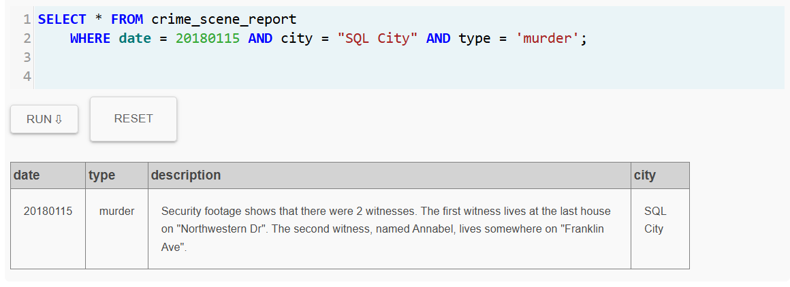
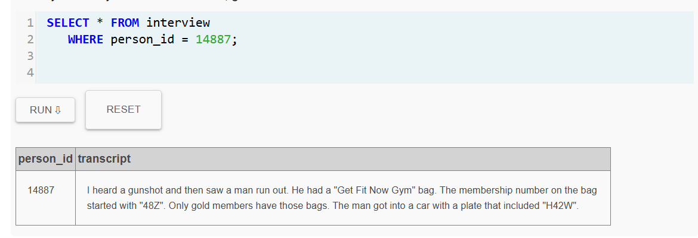
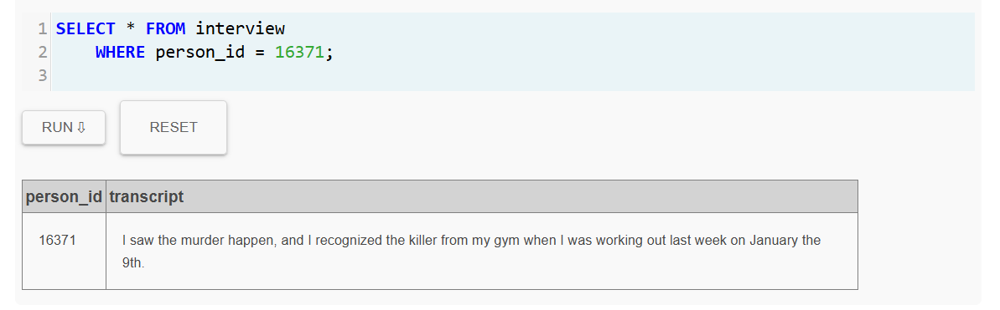
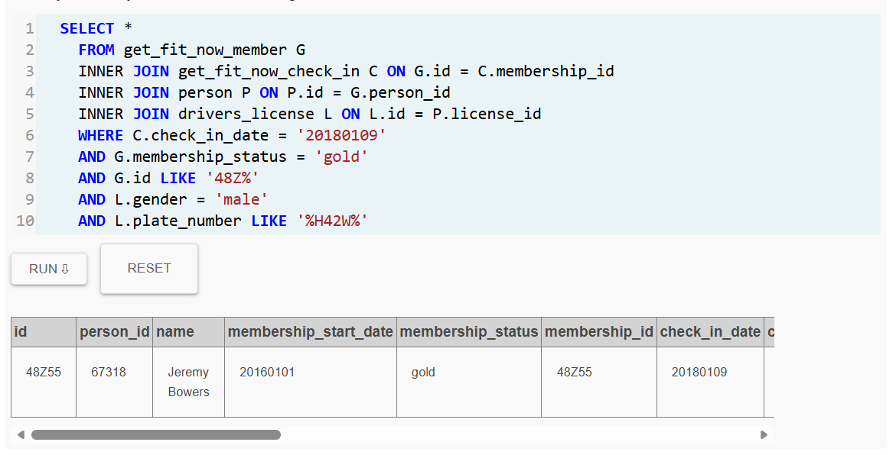
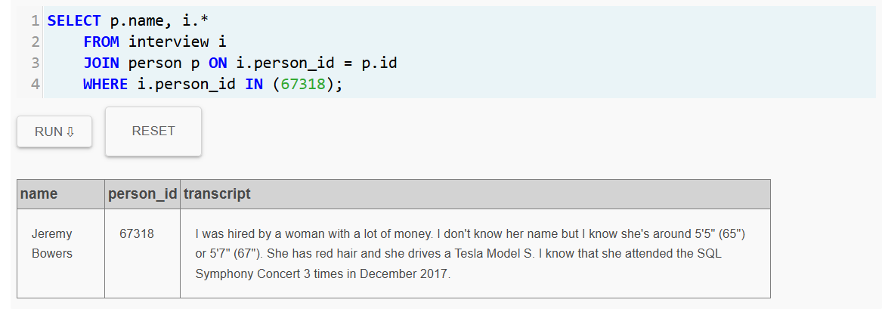
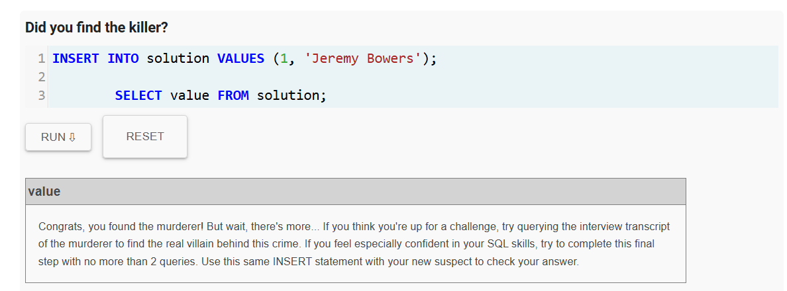
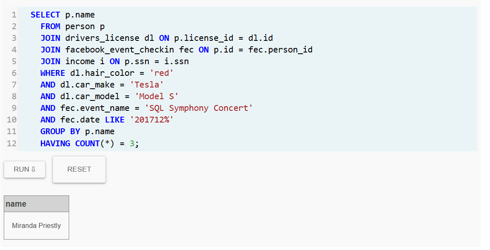
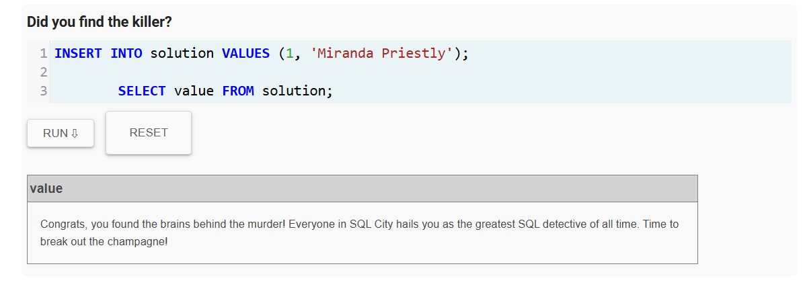

# Resolución del SQL Murder Mystery
## SQL Murder Mystery – Laboratorio 2
## Detective: Eyner Gomez Quintero

### Resumen del Caso
Después de realizar una investigación exhaustiva en la base de datos del Departamento de Policía de SQL City, se logró avanzar en el esclarecimiento del asesinato ocurrido el día 15 de enero de 2018.

Mediante el análisis de los registros y la recopilación de evidencia, se identificó al autor material del crimen, el ciudadano Jeremy Bowers. Posteriormente, el sospechoso fue sometido a un interrogatorio oficial, durante el cual proporcionó información relevante acerca de la persona que lo habría contratado para llevar a cabo el asesinato.

Gracias a esta declaración y a la verificación de los datos obtenidos, se logró identificar y capturar a la autora intelectual del crimen, Miranda Priestly, quien habría sido la responsable de planificar y ordenar la ejecución del delito.

El caso queda registrado como resuelto, tras la identificación y captura tanto del autor material como de la autora intelectual del homicidio.

### Bitácora de investigación

La investigacion comenzo con muy pocos datos en donde la unica pista que teniamos era que habia ocurrido un asesinato en "SQL City" el 15 de enero del 2018. El primer paso fue buscar los reportes policiales que ocurrieron ese dia en la ciudad: 

```
    SELECT * FROM crime_scene_report
    WHERE date = 20180115 AND city = "SQL City" AND type = 'murder';

```


Lo primero que hicimos fue localizar el reporte oficial del asesinato. En dicho informe encontramos que hubo dos testigos: el primero vive en la última casa de "Northwestern Dr" y la segunda es una mujer llamada Annabel, que vive en algún lugar de "Franklin Ave".

```
    SELECT * FROM person
	WHERE address_street_name = 'Northwestern Dr'
	ORDER BY address_number DESC
    LIMIT 1;
```
Segun el reporte inicial policial, el primer testigo residia en la casa con el **número más alto de la calle 
Northwestern Dr.** por medio de esta consulta logramos identificar a la persona que describian. 

```
    SELECT * FROM interview
	WHERE person_id = 14887;
```


Se procedió a revisar la entrevista del testigo, confirmando que cuenta con una declaración registrada en el sistema. Al analizar su testimonio, se logró obtener información clave sobre el sospechoso.
El testigo manifestó que el individuo portaba una bolsa del gimnasio "Get Fit Now Gym", que posee una membresía de tipo oro cuya identificación inicia con los caracteres "48Z", y que posteriormente abordó un vehículo cuya placa contenía los caracteres "H42W".


De acuerdo con el reporte policial, se identificó la existencia de una segunda testigo, identificada como Annabel, quien reside en Franklin Ave, por lo que se procedió a ubicar su registro con el fin de obtener información adicional relacionada con el caso.
```
    SELECT * FROM person
    WHERE address_street_name = 'Franklin Ave' AND name LIKE '%Annabel%';
```

Comprobamos la identificacion de Annabel y le realizamos un par de preguntas.

```
    SELECT * FROM interview 
    WHERE person_id = 16371;

```


El testimonio de la testigo resultó ser de gran relevancia para la investigación, ya que manifestó haber reconocido al sospechoso debido a que días antes del homicidio lo había visto asistiendo al gimnasio "Get Fit Now Gym", lugar que ella también frecuenta.

Este dato permitió orientar la investigación hacia los registros de asistencia del gimnasio, específicamente los correspondientes al día 9 de enero, enfocando la búsqueda en personas que posean membresía de tipo oro, con el fin de identificar posibles coincidencias con la descripción proporcionada del sospechoso.

Con base en las pistas recopiladas a partir de los testimonios obtenidos durante la investigación, se logró consolidar la siguiente información sobre el principal sospechoso:

1. Se trata de un individuo de sexo masculino.
2. Posee membresía de tipo oro en el gimnasio "Get Fit Now Gym".
3. Se registró su ingreso al gimnasio el día 9 de enero de 2018.
4. El vehículo que utilizaba presentaba una placa que contenía los caracteres "H42W".
5. El identificador de su membresía en el gimnasio inicia con los caracteres "48Z".
   
```
    SELECT *
    FROM get_fit_now_member G
    INNER JOIN get_fit_now_check_in C ON G.id = C.membership_id
    INNER JOIN person P ON P.id = G.person_id
    INNER JOIN drivers_license L ON L.id = P.license_id
    WHERE C.check_in_date = '20180109'
    AND G.membership_status = 'gold'
    AND G.id LIKE '48Z%'
    AND L.gender = 'male'
    AND L.plate_number LIKE '%H42W%'

```


logramos identificar el principal sospechoso Jeremy Bowers que teniendo en cuenta las investigaciones previas y las caracteristicas dadas es el unico que coinciden ahora buscamos llamarlo para obtener sus declaraciones :

```
 SELECT p.name, i.*
    FROM interview i
    JOIN person p ON i.person_id = p.id
    WHERE i.person_id IN (67318);

```


Después de analizar las declaraciones obtenidas durante la investigación, se logró identificar y capturar al autor material del asesinato ocurrido el 15 de enero de 2018, siendo este Jeremy Bowers.
Durante el proceso de interrogatorio, el detenido confesó información adicional de gran relevancia para el caso, señalando que había sido contratado por otra persona para cometer el crimen. Asimismo, proporcionó detalles sobre las características físicas de quien lo contrató, así como información sobre algunos de los lugares asistio, lo que permitió ampliar la línea de investigación para identificar al autor intelectual del homicidio.



```
    SELECT p.name
    FROM person p
    JOIN drivers_license dl ON p.license_id = dl.id
    JOIN facebook_event_checkin fec ON p.id = fec.person_id
    JOIN income i ON p.ssn = i.ssn
    WHERE dl.hair_color = 'red' 
    AND dl.car_make = 'Tesla' 
    AND dl.car_model = 'Model S'
    AND fec.event_name = 'SQL Symphony Concert'
    AND fec.date LIKE '201712%'
    GROUP BY p.name
    HAVING COUNT(*) = 3;

```


El resultado de la consulta realizada permitió identificar a la persona que cumplía con todas las características previamente descritas. Dicho análisis condujo a Miranda Priestly, quien fue posteriormente identificada como la autora intelectual del crimen.




